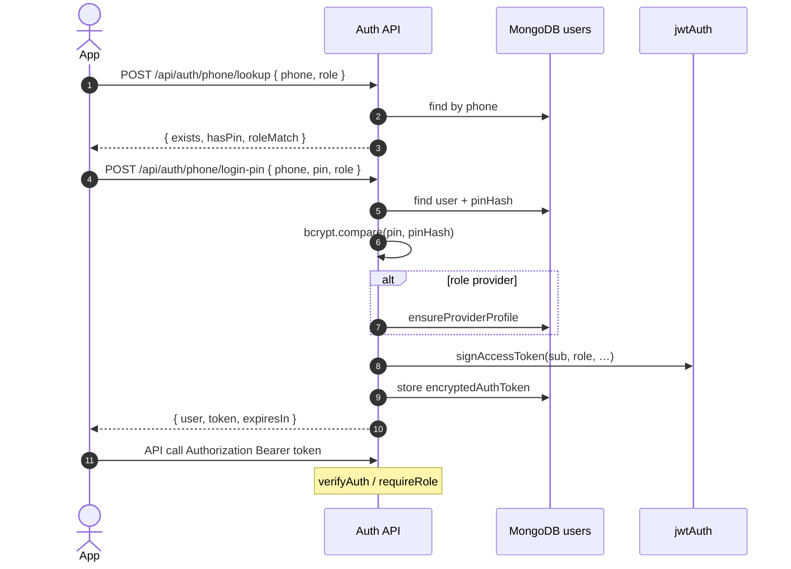
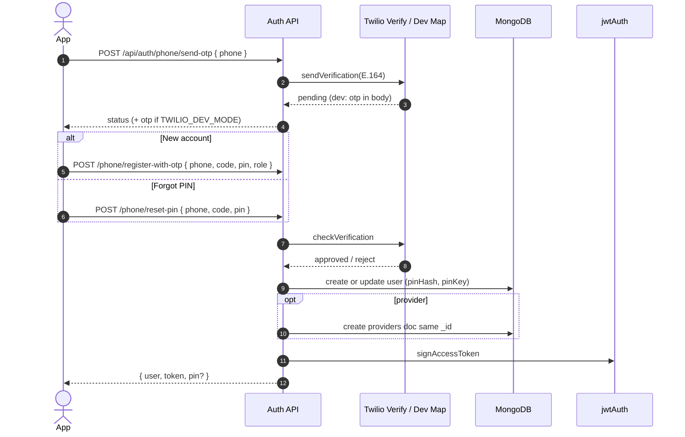
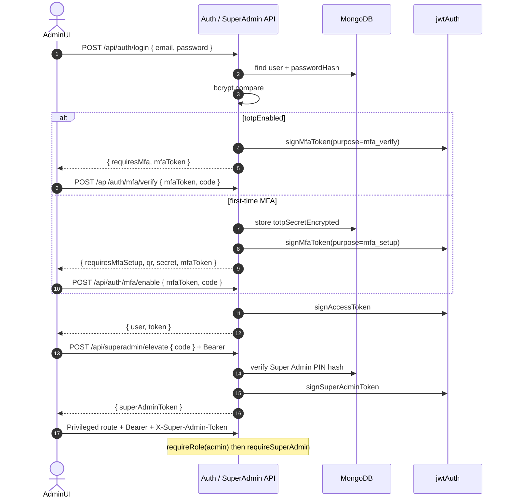
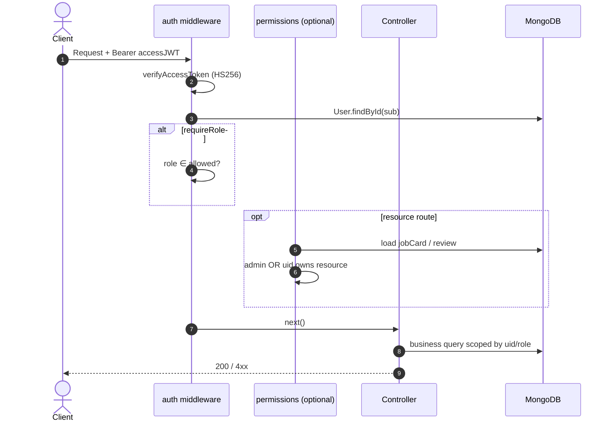
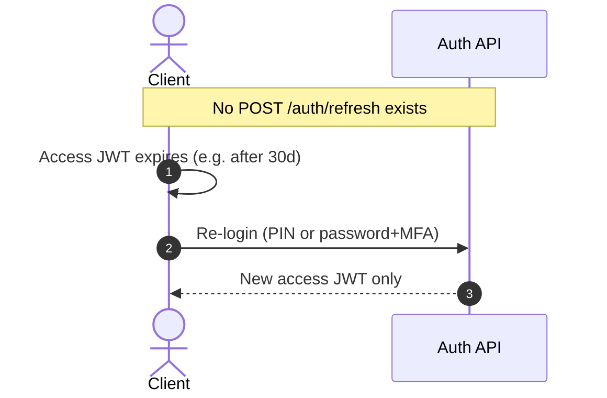

# HomeServices Backend — Authentication & Authorization

**Project:** `home-services-backend`  
**Location:** `home-services/homeServicesBackend`  
**Primary modules:** `src/controllers/authController.js`, `src/utils/jwtAuth.js`, `src/middleware/auth.js`, `src/services/twilioVerify.js`  
**Document type:** As-implemented behavior (including gaps)

---

## Summary

| Mechanism | Used for | Status |
|-----------|----------|--------|
| Phone + 6-digit PIN | Customer & Provider app login | **Primary** |
| SMS OTP (Twilio Verify) | Signup, forgot-PIN, legacy phone verify | **Optional** (required unless `TWILIO_DEV_MODE`) |
| Email/password | Admin (and legacy non-admin password users) | **Admin path** |
| TOTP MFA | Admins after password | **Required for admin** once enrolled |
| Access JWT (HS256) | All authenticated API calls | **Only session token** |
| Refresh JWT | — | **Not implemented** |
| Super Admin elevated JWT | Sensitive admin actions | Separate short-lived token |

Logout is client-side only: `POST /api/auth/logout` returns `{ loggedOut: true }` and does **not** revoke tokens.

---

## OTP Flow

OTP is used to prove phone ownership. It is **not** the day-to-day login for apps (PIN is). Codes are never stored in MongoDB.

### Providers

| Mode | Behavior |
|------|----------|
| Production | Twilio Verify REST (`Verifications` / `VerificationCheck`) |
| `TWILIO_DEV_MODE=true` | In-process `Map` of `{ code, expiresAt }` per E.164 phone; **OTP returned in API JSON** and logged as `[OTP DEV]` |

### Lifecycle

1. Client calls `POST /api/auth/phone/send-otp` with `phoneNumber` (normalized to E.164 via `toE164`).
2. Server calls `twilioVerify.sendVerification(phoneE164)`.
3. Code is a random **6-digit** value; TTL **5 minutes** (`OTP_TTL_MS`).
4. Client submits code on one of:
   - `POST /api/auth/phone/register-with-otp` — create account + set PIN + session
   - `POST /api/auth/phone/reset-pin` — replace PIN + session
   - `POST /api/auth/phone/verify-otp` — legacy: verify phone + session **without requiring PIN**
5. `checkVerification` must succeed once; in-dev store deletes the code after success or expiry.

### OTP-related endpoints

| Endpoint | Role of OTP |
|----------|-------------|
| `POST /api/auth/phone/send-otp` | Issue / send code |
| `POST /api/auth/phone/register-with-otp` | Prove phone → set PIN → JWT |
| `POST /api/auth/phone/reset-pin` | Prove phone → new PIN → JWT |
| `POST /api/auth/phone/verify-otp` | Prove phone → JWT (legacy; no PIN required) |

### Typical app path (customer / provider)

```
lookupPhone → (exists + hasPin) → login-pin
           → (new) → send-otp → register-with-otp
           → (forgot) → send-otp → reset-pin
```

**Note:** `POST /api/auth/phone/register-pin` can create a customer PIN session **without OTP**. Prefer `register-with-otp` in production clients.

---

## JWT Flow

### Token types

| Token | Purpose | Default TTL | Env | Claims (core) |
|-------|---------|-------------|-----|----------------|
| **Access** | `Authorization: Bearer …` on APIs | `30d` | `JWT_EXPIRES_IN` | `sub`, `email`, `phone`, `name`, `role` |
| **MFA bridge** | After admin password, before TOTP | `10m` | `MFA_TOKEN_EXPIRES_IN` | `sub`, `email`, `role`, `purpose`: `mfa_setup` \| `mfa_verify` |
| **Super Admin** | Elevation for privileged admin routes | `2h` | `SUPER_ADMIN_TOKEN_EXPIRES_IN` | `sub`, `email`, `role`, `purpose`: `superadmin` |

- Algorithm: **HS256**
- Secret: `JWT_SECRET` or `HMAC_JWT_SECRET` (must be **≥ 32 characters**)
- Signing: `src/utils/jwtAuth.js`

### Session issuance (`issueSessionForUser`)

On successful PIN / password / MFA / OTP-session paths:

1. Sign access JWT with user `_id` as `sub` and current role.
2. AES-encrypt the JWT (`TOKEN_ENCRYPTION_KEY`) and store as `User.encryptedAuthToken` (admin recovery / audit; **not** used to validate requests).
3. Return `{ user, token, expiresIn }` (secrets stripped from `user`).
4. Optionally include plaintext `pin` when the client just chose/reset a PIN (`includePin`).
5. Optionally issue Firebase custom token if `ENABLE_FIREBASE=true`.

### Request authentication

1. Client sends `Authorization: Bearer <accessToken>`.
2. `verifyAuth` or `requireRole` calls `verifyAccessToken` (HS256 verify + expiry).
3. Load `User` by `decoded.sub`.
4. Attach `req.user` (`uid`, `email`, `phoneNumber`, `role`) and usually `req.userDoc`.

**Authoritative role** for `requireRole` is the **database** `userDoc.role`, not the JWT claim alone.  
`verifyAuth` alone: if the user document is missing, it falls back to `decoded.role`.

### Logout

`POST /api/auth/logout` (+ optional Bearer): acknowledgement only. Tokens remain valid until expiry.

---

## Refresh Token Flow

**There is no refresh-token flow in this backend.**

| Expected pattern | Actual |
|------------------|--------|
| Short-lived access + long-lived refresh | Single long-lived access JWT (default **30 days**) |
| `POST /auth/refresh` | **Does not exist** |
| Rotate / revoke refresh family | N/A |
| Store refresh hashes | N/A |

Clients must:

- Keep the access token until `expiresIn`, or
- Re-authenticate (PIN / password + MFA) when it expires or is cleared.

Any “refresh” behavior in a mobile/web client would be **client-only** re-login, not a server refresh grant.

---

## Authorization

Authorization = **who may call which route** and **who may touch which resource**.

### Layers

| Layer | Mechanism | Location |
|-------|-----------|----------|
| Authenticate | Bearer access JWT | `middleware/auth.js` → `verifyAuth`, `requireRole`, `optionalAuth` |
| Role gate | `requireRole('admin' \| 'provider' \| 'customer')` | Same; rejects with **403** if DB role not allowed |
| Super Admin | Second token: header `X-Super-Admin-Token` or body `superAdminToken` | `middleware/requireSuperAdmin.js` |
| Resource ownership | Job card / review ownership (admins bypass) | `middleware/permissions.js` |
| Business rules | e.g. provider must be `approved` + online to accept | Controllers / `findProvidersInArea` |

### HTTP status conventions

| Code | Meaning |
|------|---------|
| **401** | Missing/invalid/expired token (or bad PIN/password/OTP/MFA) |
| **403** | Authenticated but wrong role, deactivated, or Super Admin elevation missing/mismatched |
| **404** | `requireRole` when user id in token has no `users` document |

### Public / lightly gated

- Auth routes under `/api/auth/*` (except logout optionally authenticated)
- Some shared reads use `optionalAuth` (e.g. service categories list, public provider browse, geography meta)

### Header cheat sheet

```http
Authorization: Bearer <accessJWT>
X-Super-Admin-Token: <superAdminJWT>   # when required
X-Admin-Registration-Secret: <secret>  # admin email register only
```

---

## Role Based Access

`User.role` enum: **`customer` | `provider` | `admin`**.

Phone auth helpers only allow requesting **`customer` or `provider`** (`resolveAuthRole`). Admins use email/password (+ MFA).

### Matrix (high level)

| Capability | Customer | Provider | Admin | Super Admin* |
|------------|:--------:|:--------:|:-----:|:------------:|
| Own service requests / job cards | ✓ | ✓ (assigned) | ✓ all | ✓ |
| `/api/customer/*` | JWT (`verifyAuth`)† | † | † | † |
| `/api/provider/*` | ✗ | `requireRole('provider')` | ✗ | ✗ |
| `/api/admin/*` (most) | ✗ | ✗ | `requireRole('admin')` | + elevation where wired |
| Approve providers, manage users | ✗ | ✗ | ✓ | ✓ |
| Clients branding CRUD | ✗ | ✗ | needs elevation | ✓ |
| Elevate / change Super Admin key | ✗ | ✗ | elevate / update key | update key |

\*Super Admin is **not** a DB role; it is an elevated session for an already-authenticated **admin**.

†Customer route mounts use `verifyAuth` **without** `requireRole('customer')`, so any valid JWT (including provider/admin) can hit those URLs; controllers still scope data by `req.user.uid` for ownership.

### Soft account flags

| Flag | Effect |
|------|--------|
| `User.isActive === false` | Blocked at **login** (password + PIN paths). **Not** re-checked on every `verifyAuth`. |
| `Provider.approvalStatus` | Must be `approved` for matching/accept flows; new providers start `pending`. |
| `User.adminApprovalStatus` | Field + helper `isAdminAccountApproved` exist; **login middleware does not currently reject pending admins**. Legacy empty status = approved. |

---

## Admin

### Registration

`POST /api/auth/register` with `role: "admin"` requires `ADMIN_REGISTRATION_SECRET` (≥ 8 chars) matching body `adminSecret` or header `X-Admin-Registration-Secret`.

### Login (email/password + TOTP)

```
POST /api/auth/login { email|phone, password }
  → if admin + totpEnabled  → { requiresMfa, mfaToken } → POST /api/auth/mfa/verify
  → if admin + not enrolled → { requiresMfaSetup, mfaToken, qr, secret } → POST /api/auth/mfa/enable
  → else (non-admin password user) → access JWT immediately
```

- Password: bcrypt (`passwordHash`), min length 8 on register.
- TOTP secrets encrypted at rest (`totpSecretEncrypted`); issuer via `MFA_ISSUER`.

### Super Admin elevation

1. Admin already holds access JWT.
2. `POST /api/superadmin/elevate` + `{ code }` (4-digit key) → `superAdminToken`.
3. Key verified against `systemConfig.superAdminKeyHash` (bcrypt). Default seed from `SUPER_ADMIN_PIN` or hardcoded **`7509`** until first persist.
4. In-memory rate limit: **8 attempts / 15 min / admin uid**.
5. Privileged routes: `requireRole('admin')` + `requireSuperAdmin` (e.g. clients CRUD, update Super Admin key).

### Admin API surface (role)

- `/api/admin/*` — overview, job cards, geography, area demands, …
- `/api/users` admin mutations — `requireRole('admin')`
- Shared admin-only writes — providers approve, categories CRUD, contact-recommendation admin actions
- `/api/superadmin/*` — elevate + key update

---

## Provider

### Auth

1. `POST /api/auth/phone/lookup` with `role: "provider"`.
2. New: `send-otp` → `register-with-otp` (`role: "provider"`, chosen 6-digit PIN) → creates `users` + `providers` (`ensureProviderProfile`, same `_id`, `approvalStatus: pending`).
3. Returning: `login-pin` with `role: "provider"` (rejects if number is a customer).
4. Session payload may include `approvalStatus`, `isOnline`, etc. from `providers`.

### Authorization

- All `/api/provider/serviceRequests` and `/api/provider/jobCards` routes: `verifyAuth` + `requireRole('provider')`.
- Accept / work actions additionally require approved + online/available (controller rules).
- Profile updates under shared providers routes with `requireRole('provider')`.

Providers **cannot** call admin-only endpoints. They use the same access JWT shape as customers; role is enforced by middleware + DB.

---

## Customer

### Auth

1. `lookup` → `login-pin` (primary), or OTP register / reset PIN.
2. Legacy: `verify-otp` or `register-pin` without SMS (see weaknesses).
3. Role locked to `customer` on phone helpers unless `role: "provider"` is requested.

### Authorization

- `/api/customer/serviceRequests` and `/api/customer/jobCards`: `verifyAuth` (ownership via `customerId === req.user.uid`).
- Reviews create/update: `requireRole('customer')`.
- Guests: some catalog/geography endpoints allow unauthenticated or `optionalAuth` reads; booking requires JWT.

---

## Security Weaknesses

As-implemented risks (not a full audit). Severity is relative to this codebase.

1. **No refresh tokens / no server-side revocation**  
   Stolen access JWTs work until expiry (default **30 days**). Logout does not invalidate. Compromised tokens cannot be killed without secret rotation or a denylist (not built).

2. **Long-lived access tokens**  
   30d HS256 bearer tokens amplify XSS/local-storage theft impact on web clients.

3. **`verifyAuth` does not re-check `isActive`**  
   Deactivated users keep working until token expiry if they already hold a JWT.

4. **Admin approval not enforced at login**  
   `adminApprovalStatus` / `isAdminAccountApproved` are not wired into `login` / MFA completion.

5. **Customer routes lack `requireRole('customer')`**  
   Any role with a valid JWT can invoke customer route handlers (data still keyed by `uid`, but surface is wider than intended).

6. **OTP optional on some signup paths**  
   `register-pin` issues a session without SMS proof. `verify-otp` issues a full session without setting a PIN.

7. **Global unique 6-digit PIN (`pinKey` HMAC)**  
   Only ~1e6 PINs; uniqueness enables online guessing of “is this PIN taken” and is unusual UX/security design. HMAC key falls back to literal `'pin'` if JWT secret env is missing in that helper path.

8. **Recoverable plaintext PIN (`encryptedPin`)**  
   AES-encrypted PIN stored for admin recovery increases blast radius if `TOKEN_ENCRYPTION_KEY` leaks.

9. **Dev OTP returned in API responses**  
   `TWILIO_DEV_MODE` must never be enabled in production; OTP is echoed to the client and console.

10. **In-memory OTP store**  
    Not shared across serverless instances; codes can fail or be inconsistent under multi-instance deploy. Process restart wipes codes.

11. **Default Super Admin PIN `7509`**  
    Documented default until DB hash is set — change immediately in any shared/staging/prod environment.

12. **MFA setup stores encrypted secret before confirmation**  
    First admin password login writes `totpSecretEncrypted` with `totpEnabled: false` and returns the raw `secret` in JSON — sensitive if intercepted.

13. **No brute-force limits on PIN / password / OTP**  
    Only Super Admin elevate has an in-memory attempt cap. PIN and password endpoints are unlimited at the app layer.

14. **JWT role claim can diverge**  
    Role changes in DB apply on next `requireRole` load, but long-lived tokens still carry stale `role` claim; `verifyAuth` fallback uses claim if user doc missing.

15. **Registration secret comparison**  
    Admin registration uses string equality of secrets (timing side-channel is minor vs secret strength; secret must stay long and private).

16. **Socket.IO / FCM**  
    Realtime auth model is separate; ensure sockets do not trust client-supplied user ids without the same JWT checks (verify in `realtime/socket.js` when hardening).

---

## Sequence Diagrams

### 1. Customer / Provider — PIN login (happy path)



### 2. OTP signup / forgot PIN



### 3. Admin password + TOTP + optional Super Admin



### 4. Authorized API call (role + ownership)



### 5. Refresh token (not implemented)



---

## Quick reference — auth endpoints

| Method | Path | Auth required |
|--------|------|----------------|
| POST | `/api/auth/phone/lookup` | No |
| POST | `/api/auth/phone/send-otp` | No |
| POST | `/api/auth/phone/verify-otp` | No |
| POST | `/api/auth/phone/register-pin` | No |
| POST | `/api/auth/phone/register-with-otp` | No |
| POST | `/api/auth/phone/login-pin` | No |
| POST | `/api/auth/phone/reset-pin` | No |
| POST | `/api/auth/register` | No (+ admin secret if admin) |
| POST | `/api/auth/login` | No |
| POST | `/api/auth/mfa/enable` | MFA setup token |
| POST | `/api/auth/mfa/verify` | MFA verify token |
| POST | `/api/auth/logout` | Optional Bearer |
| POST | `/api/superadmin/elevate` | Admin Bearer |
| PUT | `/api/superadmin/key` | Admin Bearer + Super Admin token |

---

## Related docs

- `BACKEND_ARCHITECTURE.md` — system context, env vars
- `API_DOCUMENTATION.md` — full request/response shapes
- `DATABASE_DOCUMENTATION.md` — `users` secrets fields, `systemConfig`

---

*Generated from `authController.js`, `jwtAuth.js`, `middleware/auth.js`, `requireSuperAdmin.js`, `twilioVerify.js`, and route mounts under `src/routes/`.*
