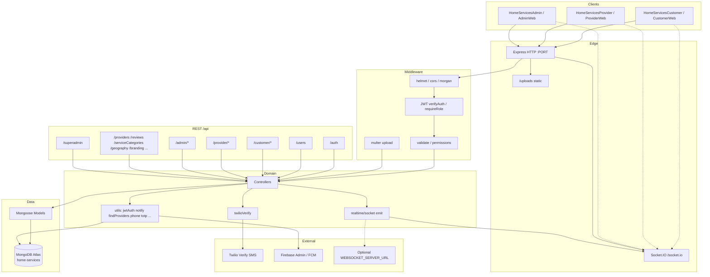
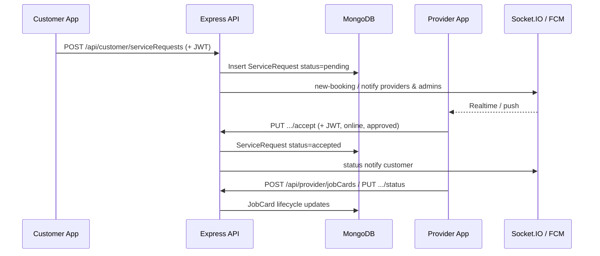

# HomeServices Backend — Architecture Documentation

**Project:** `home-services-backend`  
**Location:** `home-services/homeServicesBackend`  
**Entry point:** `src/server.js` (local) · `api/index.js` (Vercel serverless)  
**Document type:** As-implemented architecture inventory (no recommendations)

---

## 1. Folder Structure

```
homeServicesBackend/
├── api/
│   └── index.js                 # Vercel serverless export of Express app
├── src/
│   ├── server.js                # Express app, middleware, route mounts, HTTP + Socket.IO
│   ├── config/
│   │   ├── database.js          # Mongoose MongoDB connection
│   │   └── firebaseAdmin.js     # Optional Firebase Admin (FCM / legacy)
│   ├── middleware/
│   │   ├── auth.js              # JWT verifyAuth / requireRole / optionalAuth
│   │   ├── errorHandler.js      # Central error → JSON response
│   │   ├── logger.js            # Request / response / error logging helpers
│   │   ├── permissions.js       # Job-card / review ownership checks
│   │   ├── requireSuperAdmin.js # Elevated Super Admin session gate
│   │   ├── upload.js            # Multer provider-document uploads
│   │   └── validate.js          # express-validator request rules
│   ├── models/                  # Mongoose schemas (collections)
│   │   ├── User.js
│   │   ├── Provider.js
│   │   ├── ServiceRequest.js
│   │   ├── JobCard.js
│   │   ├── Review.js
│   │   ├── ServiceCategory.js
│   │   ├── Client.js
│   │   ├── State.js
│   │   ├── District.js
│   │   ├── ContactRecommendation.js
│   │   ├── AreaProviderDemand.js
│   │   ├── SystemConfig.js
│   │   └── RoleChangeLog.js
│   ├── routes/
│   │   ├── auth.js
│   │   ├── users.js
│   │   ├── superadmin.js
│   │   ├── customer/
│   │   │   ├── serviceRequests.js
│   │   │   └── jobCards.js
│   │   ├── provider/
│   │   │   ├── serviceRequests.js
│   │   │   └── jobCards.js
│   │   ├── admin/
│   │   │   ├── jobCards.js
│   │   │   ├── clients.js
│   │   │   ├── geography.js
│   │   │   ├── overview.js
│   │   │   └── areaProviderDemands.js
│   │   └── shared/
│   │       ├── providers.js
│   │       ├── reviews.js
│   │       ├── serviceCategories.js
│   │       ├── contactRecommendations.js
│   │       ├── branding.js
│   │       └── geography.js
│   ├── controllers/
│   │   ├── authController.js
│   │   ├── usersController.js
│   │   ├── superAdminController.js
│   │   ├── jobCardsController.js          # Legacy / shared helpers
│   │   ├── customer/
│   │   ├── provider/
│   │   ├── admin/
│   │   └── shared/
│   ├── services/
│   │   └── twilioVerify.js                # SMS OTP via Twilio Verify (+ dev mode)
│   ├── realtime/
│   │   └── socket.js                      # Socket.IO + HTTP emit bridges
│   └── utils/
│       ├── jwtAuth.js
│       ├── notify.js
│       ├── phone.js
│       ├── totp.js
│       ├── tokenEncryption.js
│       ├── findProvidersInArea.js
│       ├── findServiceRequestFlexible.js
│       ├── superAdmin.js
│       ├── clients.js
│       ├── geographySeed.js
│       ├── jobCardComments.js
│       ├── defaultThemeColors.js
│       └── translations.js
├── uploads/                               # Local disk for uploaded files
├── scripts/                               # Ops / agent / API check scripts
├── package.json
├── package-lock.json
├── vercel.json
├── .env.example
├── BACKEND_API.md
└── HomeServices-Backend-API.postman_collection.json
```

---

## 2. Technologies Used

| Area | Technology |
|------|------------|
| Runtime | Node.js (JavaScript) |
| HTTP API | Express 4 |
| Database | MongoDB (Atlas-oriented URI) via Mongoose 9 |
| Auth tokens | JSON Web Tokens (HS256) — `jsonwebtoken` |
| Password / PIN hashing | `bcryptjs` |
| OTP SMS | Twilio Verify REST API |
| Admin MFA | TOTP (`otplib`) + QR (`qrcode`) |
| Realtime | Socket.IO 4 |
| Push (optional) | Firebase Admin / FCM |
| File uploads | Multer (disk) |
| HTTP client | Axios |
| Security headers | Helmet |
| CORS | `cors` |
| HTTP access logs | Morgan (`dev`) |
| Config | `dotenv` |
| Validation | `express-validator` |
| Deploy (optional) | Vercel serverless (`@vercel/node` via `vercel.json`) |

---

## 3. Frameworks

- **Express.js** — primary application framework; all REST endpoints are Express routers mounted on a single `app`.
- **Mongoose** — ODM layer over MongoDB; schemas live under `src/models/`.
- **Socket.IO** — realtime layer attached to the same HTTP server created in `src/server.js` (local / long-lived hosts).
- **No NestJS, Fastify, Koa, or GraphQL framework** is used.

---

## 4. Node Version

- `package.json` does **not** declare an `"engines"` field.
- No `.nvmrc` / `.node-version` file is present in the project root.
- Local development environment observed with this repository: **Node.js v24.11.1** (host machine at documentation time). The project itself does not pin a version.

---

## 5. TypeScript Configuration

**Not present.**

- The backend is **JavaScript-only** (`"main": "src/server.js"`).
- There is no `tsconfig.json` / `jsconfig.json` for the API runtime.
- Dev dependency `@types/qrcode` exists for editor typing of the `qrcode` package only; it does not imply TypeScript compilation of the server.

---

## 6. GraphQL Structure

**Not present.**

- No GraphQL server, schema files, or GraphQL dependencies are part of this backend.
- The API surface is **REST** under `/api/*` plus Socket.IO and a small set of HTTP emit helpers.

---

## 7. Express Middleware

### Global (applied in `src/server.js`)

| Middleware | Role |
|------------|------|
| `helmet(...)` | Security headers; `crossOriginResourcePolicy: 'cross-origin'`; CSP disabled for Socket.IO / clients |
| `cors(...)` | Origin from `CORS_ORIGIN` or `*`; `credentials: true` |
| `morgan('dev')` | HTTP access logging |
| `express.json()` | JSON body parser |
| `express.urlencoded({ extended: true })` | URL-encoded body parser |
| `express.static(UPLOAD_ROOT)` at `/uploads` | Serves uploaded files |
| 404 handler | JSON `{ success: false, error: 'Not Found', ... }` |
| `logError` (from `middleware/logger`) | Logs errors before final handler |
| `errorHandler` | Final error → JSON response |

Optional (commented): global `logRequest` from `middleware/logger`.

### Route-level middleware modules

| Module | Exports / behavior |
|--------|--------------------|
| `middleware/auth.js` | `verifyAuth`, `requireRole(...roles)`, `optionalAuth` |
| `middleware/permissions.js` | Job-card / review ownership and status gates |
| `middleware/requireSuperAdmin.js` | Requires elevated Super Admin JWT after admin auth |
| `middleware/validate.js` | Field validators (job cards, reviews, IDs, pagination) |
| `middleware/upload.js` | Multer `uploadProviderDocument` |
| `middleware/logger.js` | `logRequest`, `logResponse`, `logError`, DB/perf helpers |
| `middleware/errorHandler.js` | Maps Mongo duplicate key, validation/cast errors, etc. |

Typical protected route chain: **auth → validation → ownership → logging → controller**.

---

## 8. Authentication Flow

Primary customer/provider auth is **phone + 6-digit PIN**. Email/password exists for registration/login (admin path includes TOTP MFA).

### Session issuance (`issueSessionForUser` in `authController`)

1. Build JWT payload: `sub` (user `_id`), `email`, `phone`, `name`, `role`.
2. Sign access token via `signAccessToken` (HS256).
3. Encrypt JWT with AES and store as `User.encryptedAuthToken`.
4. Optionally create Firebase custom token if `ENABLE_FIREBASE=true`.
5. Strip secrets from user object (`passwordHash`, `pinHash`, `pinKey`, `encryptedPin`, `encryptedAuthToken`, `totpSecretEncrypted`).
6. Attach `hasPin`, `phoneVerified`; for providers load `Provider` for `approvalStatus`, `specialization`, `isOnline`.
7. Return `{ user, token, expiresIn }` (and sometimes one-time `pin`).

### Phone auth (mobile apps)

```
lookupPhone → (exists + hasPin) → loginPin
           → (new / no PIN) → sendPhoneOtp → registerWithOtp | resetPin
```

### Email/password (incl. admin)

```
register | login
login (admin) → requiresMfaSetup | requiresMfa → mfa/enable | mfa/verify → session JWT
```

### Request authentication

Clients send `Authorization: Bearer <accessToken>`.  
`verifyAuth` / `requireRole` verify JWT, load `User` by `sub`, attach `req.user` / `req.userDoc`.

### Logout

`POST /api/auth/logout` — acknowledgements only (`loggedOut: true`); JWT remains client-managed (stateless).

---

## 9. OTP Flow

Implemented in `src/services/twilioVerify.js`, used by auth phone endpoints.

### Production (`TWILIO_DEV_MODE` not true)

1. Requires `TWILIO_ACCOUNT_SID`, `TWILIO_AUTH_TOKEN`, `TWILIO_VERIFY_SERVICE_SID`.
2. **Send:** Twilio Verify `Verifications` API (`Channel=sms`).
3. **Check:** Twilio Verify `VerificationCheck`; approved when `status === 'approved'`.

### Dev mode (`TWILIO_DEV_MODE=true`)

1. Treated as configured without live Twilio.
2. In-memory `Map` keyed by E.164 phone.
3. Random 6-digit OTP, TTL **5 minutes**.
4. Response may include `otp`, `expiresAt`, `expiresInSeconds` for in-app banners.
5. Check is one-time (match then delete).

### Auth endpoints using OTP

| Endpoint | Role of OTP |
|----------|-------------|
| `POST /api/auth/phone/send-otp` | Send code |
| `POST /api/auth/phone/verify-otp` | Verify + session (legacy; no PIN required) |
| `POST /api/auth/phone/register-with-otp` | Verify + set PIN + session |
| `POST /api/auth/phone/reset-pin` | Verify + replace PIN + session |

Phone numbers are normalized via `utils/phone.js` (India `+91` / 10-digit local).

---

## 10. JWT Flow

Implemented in `src/utils/jwtAuth.js`.

| Token type | Purpose | Default TTL | Env override |
|------------|---------|-------------|--------------|
| Access token | API Bearer auth | `30d` | `JWT_EXPIRES_IN` |
| MFA token | Bridge after admin password, before TOTP | `10m` | `MFA_TOKEN_EXPIRES_IN` |
| Super Admin token | Elevated admin session after PIN | `2h` | `SUPER_ADMIN_TOKEN_EXPIRES_IN` |

- Algorithm: **HS256**.
- Secret: `JWT_SECRET` or `HMAC_JWT_SECRET` (must be ≥ 32 characters).
- Access claims: `sub`, `email`, `phone`, `name`, `role`.
- MFA claims include `purpose`: `mfa_setup` | `mfa_verify`.
- Super Admin claims include `purpose: 'superadmin'`.

Middleware verifies Bearer tokens and maps `sub` → MongoDB `User._id`.

---

## 11. Database Collections

Mongoose models map to these MongoDB collections (default DB name `home-services` via `MONGODB_DB_NAME`):

| Collection | Model file |
|------------|------------|
| `users` | `User.js` |
| `providers` | `Provider.js` |
| `serviceRequests` | `ServiceRequest.js` |
| `jobCards` | `JobCard.js` |
| `reviews` | `Review.js` |
| `serviceCategories` | `ServiceCategory.js` |
| `clients` | `Client.js` |
| `states` | `State.js` |
| `districts` | `District.js` |
| `contactRecommendations` | `ContactRecommendation.js` |
| `areaProviderDemands` | `AreaProviderDemand.js` |
| `systemConfig` | `SystemConfig.js` (singleton `_id: 'global'`) |
| `roleChangeLogs` | `RoleChangeLog.js` |

---

## 12. MongoDB Schema Relationships

Most relationships are **logical string IDs** (and denormalized name/phone fields), not heavy Mongoose `populate` graphs. Exception: `RoleChangeLog` uses `ref: 'User'`.

```
User (_id: String UUID)
  │
  ├── 1:1 ──► Provider (_id === User._id)   [role === 'provider']
  │
  ├── 1:N ──► ServiceRequest.customerId
  ├── 1:N ──► JobCard.customerId
  ├── 1:N ──► Review.customerId
  ├── 1:N ──► AreaProviderDemand.customerId
  └── 1:N ──► ContactRecommendation.recommendedBy

Provider (_id)
  ├── 1:N ──► ServiceRequest.providerId (when assigned)
  ├── 1:N ──► JobCard.providerId
  └── 1:N ──► Review.providerId

ServiceRequest (_id)
  └── optional link ──► JobCard.serviceRequestId / bookingId

State (_id)
  └── 1:N ──► District.stateId

Client (_id)
  └── referenced by SystemConfig.activeClientId (branding theme)

SystemConfig (_id: 'global')
  └── superAdminKeyHash, activeClientId
```

### Notable enums

**ServiceRequest.status:** `pending` | `accepted` | `in-progress` | `completed` | `cancelled` | `rejected`  
**ServiceRequest.urgency:** `immediate` | `scheduled`  
**JobCard.status:** `unassigned` | `pending` | `accepted` | `in-progress` | `completed` | `cancelled`  
**Provider.approvalStatus:** `pending` | `approved` | `rejected`  
**User.role:** `customer` | `provider` | `admin`  
**AreaProviderDemand.status:** `open` | `in_progress` | `resolved` | `dismissed`

---

## 13. GraphQL Schema

**Not present.** There is no GraphQL type system in this repository.

---

## 14. Resolvers

**Not present.** No GraphQL resolvers. Business logic lives in **Express controllers** under `src/controllers/`.

---

## 15. Services

Named service modules under `src/services/`:

| Service | File | Responsibility |
|---------|------|----------------|
| Twilio Verify | `twilioVerify.js` | Send/check SMS OTP; in-memory OTP in `TWILIO_DEV_MODE` |

Additional “service-like” logic also exists in:

- `utils/notify.js` — FCM push helpers  
- `utils/findProvidersInArea.js` — geo + service-type provider matching  
- `realtime/socket.js` — realtime emit / room management  
- Controllers — domain orchestration against Mongoose models  

There is no separate application-layer service folder for bookings, payments, or users beyond the above.

---

## 16. Repository Pattern

**Not used.**

- Controllers call **Mongoose models** (and occasionally `getCollection` from `config/database.js`) directly.
- There is no `repositories/` or DAO layer abstracting persistence.

---

## 17. Utilities

| Utility | Purpose |
|---------|---------|
| `jwtAuth.js` | Sign/verify access, MFA, and Super Admin JWTs |
| `tokenEncryption.js` | AES-256-GCM encrypt/decrypt for stored JWT, PIN, TOTP secrets |
| `phone.js` | E.164 / 10-digit India phone normalization and display |
| `totp.js` | Admin authenticator secret, otpauth URL, QR, verify |
| `notify.js` | FCM notify user / provider / admins (no-op if Firebase unavailable) |
| `findProvidersInArea.js` | District → pincode provider search; nearby pending for providers |
| `findServiceRequestFlexible.js` | Flexible ServiceRequest lookup by mixed ID shapes |
| `superAdmin.js` | Super Admin PIN hash/verify/update; admin approval helpers |
| `clients.js` | Client / branding helpers |
| `geographySeed.js` | Seed states/districts (idempotent) |
| `jobCardComments.js` | Comment append helpers for job cards |
| `defaultThemeColors.js` | Default theme palette for clients |
| `translations.js` | Language detection / translation helpers for responses |

---

## 18. Environment Variables

### Documented in `.env.example`

| Variable | Role |
|----------|------|
| `PORT` | HTTP port (scripts commonly use `3001`) |
| `NODE_ENV` | `development` / production |
| `MONGODB_URI` | MongoDB connection URI (**required**) |
| `MONGODB_DB_NAME` | Database name (default `home-services`) |
| `JWT_SECRET` | HS256 signing secret |
| `TOKEN_ENCRYPTION_KEY` | AES key for encrypted fields |
| `ADMIN_REGISTRATION_SECRET` | Required secret to register `admin` role |
| `WEBSOCKET_SERVER_URL` | Optional remote websocket bridge |
| `TWILIO_ACCOUNT_SID` | Twilio account |
| `TWILIO_AUTH_TOKEN` | Twilio auth token |
| `TWILIO_VERIFY_SERVICE_SID` | Twilio Verify service |
| `TWILIO_DEV_MODE` | Skip live SMS; in-memory OTP |
| `TWILIO_DEV_OTP` | Listed in `.env.example`; **not read by current `twilioVerify.js` code** |

### Also referenced in code

| Variable | Role |
|----------|------|
| `HMAC_JWT_SECRET` | Alternate JWT secret name |
| `JWT_EXPIRES_IN` | Access token TTL |
| `MFA_TOKEN_EXPIRES_IN` | MFA bridge token TTL |
| `SUPER_ADMIN_TOKEN_EXPIRES_IN` | Super Admin elevation TTL |
| `ENCRYPTION_KEY` | Alternate name for token encryption key |
| `CORS_ORIGIN` | CORS allowlist |
| `VERCEL` / `VERCEL_ENV` | Skip `listen()`; serverless path |
| `ENABLE_FIREBASE` | Optional Firebase custom token on login |
| `SERVICE_ACCOUNT_KEY_PATH` | Firebase service account file |
| `FIREBASE_SERVICE_ACCOUNT` | Firebase service account JSON string |
| `MFA_ISSUER` | TOTP issuer label |
| `SUPER_ADMIN_PIN` | Default Super Admin PIN source |

---

## 19. Security

| Mechanism | Implementation |
|-----------|----------------|
| Transport headers | Helmet |
| CORS | Configurable origin |
| API auth | Bearer JWT (HS256) |
| Passwords | bcrypt (`SALT_ROUNDS=12` in auth paths) |
| Customer/provider PIN | bcrypt `pinHash` + global uniqueness `pinKey` (HMAC) |
| Stored secrets | AES-GCM via `tokenEncryption` (`encryptedAuthToken`, `encryptedPin`, `totpSecretEncrypted`) |
| Admin MFA | TOTP after password login |
| Super Admin | Separate elevated JWT after 4-digit PIN (`SystemConfig.superAdminKeyHash`) |
| Admin registration | `ADMIN_REGISTRATION_SECRET` gate |
| Role gates | `requireRole('customer'|'provider'|'admin')` |
| Ownership | `permissions.js` on job cards / reviews |
| Upload limits | 8 MB; image/PDF MIME and extension allowlists |
| Error responses | Stack traces only when `NODE_ENV=development` |
| Logging sanitization | Logger redacts password/token/pin-like fields |

Architecture constraint (from `database.js`): **only the backend connects to MongoDB**; client apps use the API exclusively.

---

## 20. Logging

| Layer | Mechanism |
|-------|-----------|
| HTTP access | `morgan('dev')` on every request |
| Structured helpers | `middleware/logger.js` — `logRequest`, `logResponse`, `logError`, `logDatabaseOperation`, `logPerformance` |
| Console | Startup banners, Mongo connect, auth errors, OTP `[OTP DEV]` logs, Socket.IO diagnostics |
| Error pipeline | `logError` middleware then `errorHandler` |

Global `logRequest` is available but not enabled by default in `server.js` (commented).

---

## 21. Notification System

### A. Push (FCM) — `utils/notify.js`

- Uses optional Firebase Admin.
- Helpers: `notifyUser`, `notifyProvider` (Provider token with User fallback), `notifyAdmins`.
- No-op when Firebase or device tokens are missing.

### B. Realtime (Socket.IO) — `realtime/socket.js`

**Path:** `/socket.io/`

**Rooms:**

- `provider-{providerId}`
- `customer-{customerId}`
- `admin`

**Server → client events (examples):**

- `new-booking` → provider room  
- `service-request-status` → customer  
- `service-completed` → customer  
- `new-service-request` → admin  

**HTTP compat emit:** `POST /emit-booking`, `POST /emit-service-completed`  
**Optional bridge:** if local emit fails, POST to `WEBSOCKET_SERVER_URL`.

Vercel serverless cannot keep long-lived WebSocket connections; Socket.IO is intended for long-lived Node hosts.

---

## 22. Payment Flow

**Not implemented.**

- No payment gateway integration (Stripe, Razorpay, etc.) appears in `src/`.
- Monetary-related fields such as `Provider.serviceFee` and `JobCard.serviceAmount` are data fields only, not a checkout or settlement pipeline.

---

## 23. File Upload Flow

1. **Route:** `POST /api/providers/:providerId/documents/:docKey` (admin-authenticated).
2. **Middleware:** Multer `uploadProviderDocument` (`.single('file')`).
3. **Allowed `docKey`:** `idProof` | `addressProof` | `certificate`.
4. **Storage:** disk under `uploads/provider_documents/`.
5. **Filename pattern:** `{providerId}_{docKey}_{timestamp}_{random}{ext}`.
6. **Limits:** 8 MB; MIME `image/*` or `application/pdf`; extensions `.jpg/.jpeg/.png/.webp/.pdf/.gif`.
7. **Persistence:** URL `/uploads/provider_documents/{filename}` written on `Provider.documents[docKey]`; verification flags reset.
8. **Serving:** static mount `GET /uploads/...`.

Customer service-request **photos** are typically base64/URL strings on the `ServiceRequest.photos` array via create/update bodies (not a dedicated multipart photo route).

---

## 24. Booking Flow

In this codebase, a **booking** is a **ServiceRequest** (realtime/FCM payloads use “booking” terminology). A **JobCard** is the operational work order after accept / admin assign / admin-assist unassigned create.

### Create (customer)

`POST /api/customer/serviceRequests`

1. Validates address + pincode + `serviceType`.
2. Creates `ServiceRequest` with `status: pending`.
3. Modes:
   - **Targeted:** body `providerId` reserved for that provider.
   - **Open:** any nearby approved online provider may accept.
   - **Admin help:** `requestAdminHelp` / no providers in area → flags + possible `JobCard` with `status: unassigned`.
4. Notifies providers (Socket + FCM) and admins as applicable.

### Provider accept / reject

- `PUT /api/provider/serviceRequests/:id/accept` → `accepted` (provider must be approved + online).
- `PUT /api/provider/serviceRequests/:id/reject`:
  - Open request → append `declinedProviders`, stay `pending`.
  - Targeted → `rejected`.

### Customer cancel

- `PUT /api/customer/serviceRequests/:id/cancel` → `cancelled`.

### Job card progression

Provider/admin update job-card status through:

- `pending` / `accepted` / `in-progress` / `completed` / `cancelled`  
- Optional `taskPIN`, amounts, materials, PDF URL.

### Area demand (no providers)

`POST /api/customer/serviceRequests/request-area-providers` upserts `AreaProviderDemand` for admin follow-up.

---

## 25. Provider Flow

| Concern | API surface |
|---------|-------------|
| Auth | Phone PIN / OTP under `/api/auth/phone/*` with `role: provider`; `ensureProviderProfile` creates `Provider` with same `_id` |
| Profile / online | `GET/PUT /api/providers/me`, `PUT /api/providers/me/status` |
| Nearby / pending jobs | `GET /api/provider/serviceRequests/nearby-pending`, `/pending` |
| Accept / reject | `PUT .../accept`, `PUT .../reject` |
| Job cards | `GET/POST /api/provider/jobCards`, `PUT .../status`, comments |
| Approval | Admin `PUT /api/providers/:id/approval` |
| Documents | Admin upload to `/api/providers/:id/documents/:docKey` |

Providers receive `new-booking` on their Socket.IO room and optional FCM.

---

## 26. Customer Flow

| Concern | API surface |
|---------|-------------|
| Auth | Phone lookup → PIN login or OTP register/reset |
| Profile / addresses | `GET/PUT /api/users/me` (`homeAddress`, `officeAddress`, `serviceAddresses`, …) |
| Book service | `POST /api/customer/serviceRequests` |
| List / get / update / cancel | Customer service-request routes |
| Ask for area providers | `POST .../request-area-providers` |
| Job cards | `GET /api/customer/jobCards`, cancel, comments |
| Reviews | `POST /api/reviews` (completed job ownership rules) |
| Browse providers / categories | Shared `GET /api/providers`, `GET /api/serviceCategories` |
| Branding / geography | `GET /api/branding`, `GET /api/geography/meta` |

---

## 27. Admin Flow

| Concern | API surface |
|---------|-------------|
| Auth | Email/password + TOTP MFA (`/api/auth/login`, `/mfa/*`) |
| Super Admin elevation | `POST /api/superadmin/elevate` → PIN → `superAdminToken`; `PUT /api/superadmin/key` |
| Job board / assign | `/api/admin/jobCards` (list, assign, unassign, update, delete, comments) |
| Clients / themes | `/api/admin/clients` (requires Super Admin) |
| Geography ops | `/api/admin/geography` |
| Overview stats | `GET /api/admin/overview/stats` |
| Area provider demands | `/api/admin/area-provider-demands` |
| Providers | Approval, document upload, updates under `/api/providers` |
| Users | Admin CRUD / deactivate under `/api/users` |
| Categories | Admin CRUD under `/api/serviceCategories` |
| Contact recommendations | Admin list/status under `/api/contactRecommendations` |

---

## 28. Dependencies

From `package.json`:

### Runtime

| Package | Version (declared) | Role in this project |
|---------|--------------------|----------------------|
| `express` | ^4.18.2 | HTTP framework |
| `mongoose` | ^9.1.4 | ODM |
| `mongodb` | ^6.21.0 | Native driver (compat / direct collection use) |
| `dotenv` | ^16.3.1 | Load `.env` |
| `cors` | ^2.8.5 | Cross-origin |
| `helmet` | ^7.1.0 | Security headers |
| `morgan` | ^1.10.0 | Access logs |
| `jsonwebtoken` | ^9.0.3 | JWT |
| `bcryptjs` | ^2.4.3 | Password/PIN hashing |
| `express-validator` | ^7.0.1 | Validation |
| `multer` | ^2.2.0 | Uploads |
| `socket.io` | ^4.8.3 | Realtime |
| `firebase-admin` | ^13.6.0 | Optional FCM / Firebase |
| `axios` | ^1.13.3 | Outbound HTTP |
| `otplib` | ^13.4.1 | TOTP |
| `qrcode` | ^1.5.4 | MFA QR images |

### Development

| Package | Role |
|---------|------|
| `nodemon` | Dev reload (`npm run dev`) |
| `@types/qrcode` | Type hints for `qrcode` |

### npm scripts

- `start` — `PORT=3001 node src/server.js`  
- `dev` — `PORT=3001 nodemon src/server.js`  
- `check:api` — `node scripts/check-api.js`  

---

## 29. Design Patterns

Observable patterns in the current codebase:

| Pattern | How it appears |
|---------|----------------|
| Layered MVC-style Express | `routes` → `middleware` → `controllers` → `models` |
| App-scoped API segmentation | `customer/`, `provider/`, `admin/`, `shared/` route trees aligning with client apps |
| Middleware pipeline | Auth → validate → permissions → logging → controller |
| Stateless JWT sessions | Access tokens; logout does not revoke server-side |
| Dual auth strategies | Phone+PIN (apps) and email+password+TOTP (admin) |
| Soft references + denormalization | String IDs with copied names/phones on ServiceRequest / JobCard |
| 1:1 User↔Provider by shared `_id` | Provider document id equals User id |
| Thin service module | Twilio isolated under `services/` |
| Utility helpers | Cross-cutting crypto, phone, geo, notify |
| Realtime sidecar | Socket.IO co-hosted with HTTP |
| Optional integrations | Firebase / remote websocket URL when configured |
| Singleton config document | `SystemConfig` `_id: 'global'` |

**Not used:** GraphQL resolvers, TypeScript DI containers, repository/DAO layer, CQRS, event sourcing, payment orchestrators.

---

## 30. Overall Architecture Diagram (Mermaid)



### Booking sequence (high level)



---

## Appendix A — Auth route catalog

Mounted at `/api/auth`:

| Method | Path |
|--------|------|
| GET | `/health` |
| POST | `/register` |
| POST | `/login` |
| POST | `/logout` |
| POST | `/mfa/enable` |
| POST | `/mfa/verify` |
| POST | `/phone/lookup` |
| POST | `/phone/register-pin` |
| POST | `/phone/register-with-otp` |
| POST | `/phone/login-pin` |
| POST | `/phone/reset-pin` |
| POST | `/phone/send-otp` |
| POST | `/phone/verify-otp` |

---

## Appendix B — Primary API mounts (`server.js`)

| Mount | Audience |
|-------|----------|
| `/health` | Ops |
| `/api/auth` | All |
| `/api/superadmin` | Admin elevation |
| `/api/users` | Shared |
| `/api/providers` | Shared |
| `/api/reviews` | Shared |
| `/api/serviceCategories` | Shared |
| `/api/contactRecommendations` | Shared |
| `/api/branding` | Shared (public theme) |
| `/api/geography` | Shared (public meta) |
| `/api/customer/jobCards` | Customer |
| `/api/customer/serviceRequests` | Customer |
| `/api/provider/jobCards` | Provider |
| `/api/provider/serviceRequests` | Provider |
| `/api/admin/jobCards` | Admin |
| `/api/admin/clients` | Admin (+ Super Admin) |
| `/api/admin/geography` | Admin |
| `/api/admin/overview` | Admin |
| `/api/admin/area-provider-demands` | Admin |

---

## Appendix C — Deployment notes (as coded)

- **Local:** `startServer()` connects MongoDB, attaches Socket.IO, listens on `0.0.0.0:PORT`.
- **Vercel:** `api/index.js` exports the Express `app`; `vercel.json` routes all traffic to that function. Socket.IO long-lived behavior is not available in that serverless model; Mongo connect is initiated for serverless reuse.

---

*Generated from the repository state of `homeServicesBackend` as an as-built architecture record.*
